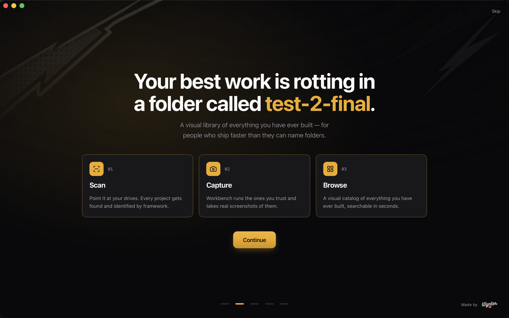
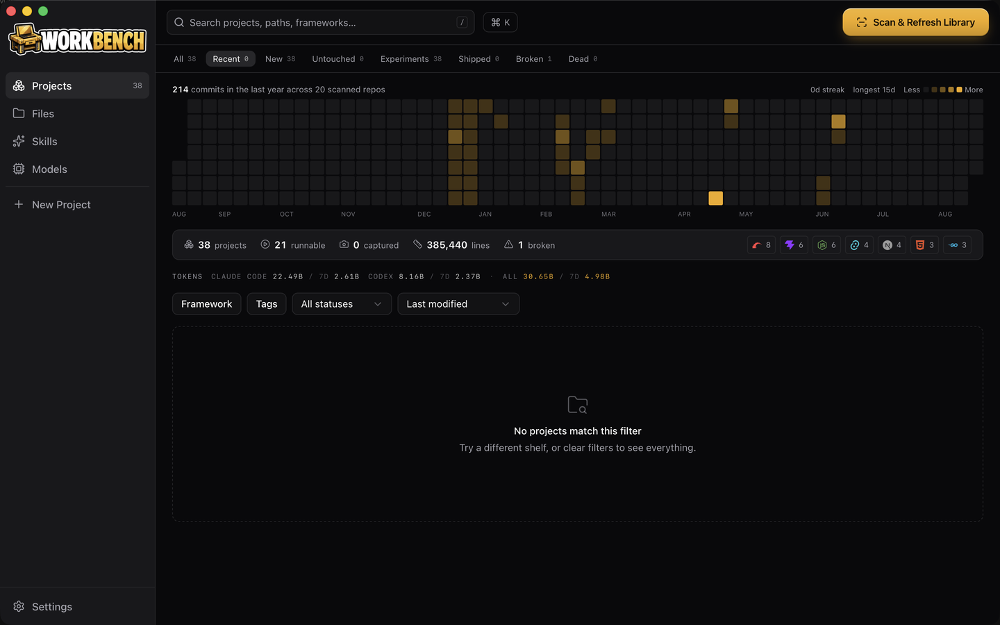

<div align="center">


### A visual library of everything you have ever built.

For people who ship faster than they can name folders.



</div>

---

Your hard drive is a graveyard of half-finished ideas. Somewhere in there is a project
that was 80% done, one that solved a problem you're about to solve again, and three you
have completely forgotten exist.

Workbench scans your drives, identifies every project by framework, runs the ones you
trust, screenshots them, and turns a decade of scattered folders into something you can
actually browse.

**Scan → Identify → Run → Screenshot → Browse → Decide → Act**



## What it does

**Finds everything.** Point it at `~/Code`, `~/Projects`, an external drive — whatever.
It walks the filesystem and recognises Next.js, Vite, Tauri, Rails, Go, Rust, Python,
Chrome extensions, Godot, WordPress, and more from their signature files. It knows the
difference between a Tauri app and the Vite app inside it.

**Shows you what they look like.** For projects you explicitly trust, Workbench starts
them, waits for the server, captures desktop and mobile screenshots, then kills the
process. No more wondering what `test-app-4-final-new` was.

**Tells you what's closest to done.** A ship score built from real signals — does it run,
does it have a README, auth, payments, deployment config, tests, recent activity — with
an effort estimate.

**Remembers your whole career.** A contribution heatmap built from local git history
across every scanned repo, so private and unpushed work counts too. Token usage from your
Claude Code and Codex logs. Timelines that merge commits with scan activity.

**Browses files properly.** Miller columns, instant preview for code, markdown, images,
video and PDFs, git status in the gutter, and build artefacts folded away so a repo is
readable at a glance.

**Manages your agents.** Detects which AI coding CLIs you have installed — Claude Code,
Codex, Gemini, Cursor, Copilot, OpenCode, Crush, OpenClaw, Hermes, Pi and more — and
manages the skills installed for Claude Code and Codex, with search and install from
skills.sh built in.

**Starts the next one.** 127 verified project starters across React, Next.js, shadcn/ui,
Vue, Svelte, Astro, Python, Rust, Go, Ruby, PHP, mobile, desktop, extensions and AI.

## Install

Download the latest `.dmg` from [Releases](../../releases), drag Workbench to
Applications, and open it.

Requires macOS 10.15 or later. Optional: Chrome for screenshots, git for history,
tmux for background AI sessions, Node for JavaScript projects. Workbench checks for
these on first run and tells you what each one unlocks.

## Your data stays yours

Everything lives in `~/.workbench/` — a SQLite database, screenshots, and generated
prompts. Nothing is uploaded. There is no account, no telemetry, and no network call
except the ones you explicitly trigger.

**Workbench never executes your project code without permission.** Scanning is strictly
read-only. Running a project requires you to approve the exact command first, and the
trust flag is per-project.

## Building from source

```bash
git clone https://github.com/WynterJones/Workbench-App.git
cd Workbench-App
npm install
npm run tauri dev
```

Requires Rust and Node 20+.

```bash
npm test          # frontend tests
cargo test        # in src-tauri/
npm run tauri build
```

## How it is built

```
src/                    React 19 + TypeScript + Tailwind v4 + shadcn/ui
  components/           app shell, shared primitives
  features/             intro, library, project, files, skills, models, settings
  hooks/                data access
  lib/                  types, api, store, formatting
src-tauri/src/
  db.rs models.rs       SQLite persistence
  scan/                 walker, framework detection, git, metadata
  run/                  process manager, screenshot capture
  files/                listing, path guard, starters, context
  skills.rs agents.rs   skill and agent management
  score.rs heatmap.rs   ship score, contribution graph
```

Tauri v2 with a Rust core. Dark theme only.

## License

MIT

<div align="center">
<br>
Made by <a href="https://wynter.ai">Wynter.ai</a>
</div>
